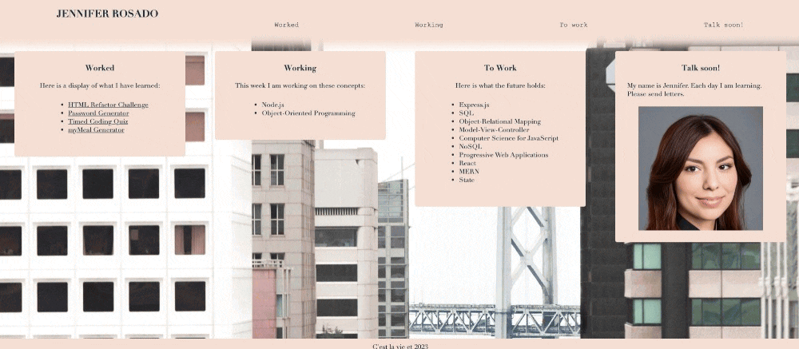

# Jennifers-Beginning-Portfolio
## UCB Bootcamp Module 2 Homework Challenge
This is my re-submission for the UCB Bootcamp Module 4 Homework Challenge. Phew! I am so proud of myself for dialing in my vision and figuring out the joys of flexbox. First and foremost, this submission includes a live deployed site for review. I've included a photo of myself, and my navigation links to each corresponding section when the page is in column-view out of responsiveness to a smaller viewport. However, the "Worked" navigation link sends the "Worked" section to behind the navigation bar when the page is in column-view out of responsiveness to a smaller viewport. My next steps are to resolve this bug so that the responsive view presents seamlessly.

## Deployed page
https://jmariemo.github.io/jennifers-beginning-portfolio/

## GIF of page
